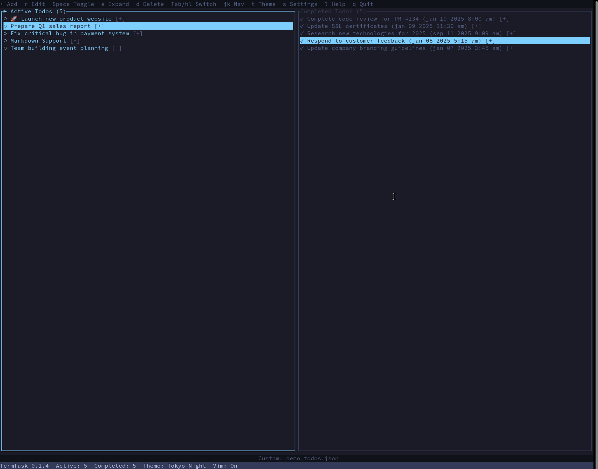

# TermTask 

A beautiful, keyboard-driven terminal todo application built with Rust. Features a split-screen interface, markdown support, multiple color themes, and JSON storage for easy version control.



## Features

- ✨ **Split-screen interface** - Active todos on the left, completed on the right
- 🎨 **Multiple color themes** - Catppuccin Mocha, Nord, Dracula, and High Contrast
- 📝 **Rich markdown support** - Format your todo descriptions with headers, lists, code blocks, and more
- ⌨️ **Keyboard-driven** - Fast and efficient workflow without touching the mouse
- 💾 **JSON storage** - Human-readable, git-friendly todo storage
- 🔧 **Configurable** - Customizable themes and adjustable split-screen ratio
- 🌍 **Full Unicode support** - Use emojis and international characters in your todos

## Installation

### From Source

Ensure you have [Rust](https://www.rust-lang.org/tools/install) installed, then:

```bash
# Clone the repository
git clone https://github.com/babinc/TermTask.git
cd TermTask

# Build and install
cargo install --path .
```

### Using Cargo

```bash
cargo install termtask
```

## Usage

### Running TermTask

```bash
# Launch with default todo file (~/.local/share/termtask/todos.json)
termtask

# Use a custom todo file
termtask --file my_todos.json
```

### Keyboard Shortcuts

| Key | Action |
|-----|--------|
| `a` | Add new todo |
| `r` | Edit selected todo (title and description) |
| `Space` | Toggle todo completion status |
| `e` | Expand/collapse todo description |
| `d` | Delete selected todo |
| `Tab` | Switch between active and completed panes |
| `↑/↓` | Navigate through todos |
| `+/=` | Increase split ratio (more space for active todos) |
| `-` | Decrease split ratio (more space for completed todos) |
| `t` | Quick theme toggle |
| `s` | Open settings modal |
| `q` | Quit application |

### Vim Mode

TermTask includes built-in Vim keybindings for navigation and editing:

#### Navigation
- `j` - Move down
- `k` - Move up  
- `g` - Jump to first todo
- `G` - Jump to last todo

#### Actions
- `i` or `a` - Insert mode (add new todo)
- `o` - Open new todo below current selection
- `O` - Open new todo above current selection
- `dd` - Delete current todo
- `x` - Toggle todo completion
- `v` - Expand/collapse description (visual mode)

#### Pane Management
- `h` - Switch to left pane (active todos)
- `l` - Switch to right pane (completed todos)

Vim mode is automatically enabled and works alongside the standard keybindings.

### Markdown Support

Todo descriptions support full markdown formatting:

- **Headers** - `## Section Title`
- **Bold/Italic** - `**bold**`, `*italic*`
- **Lists** - Both ordered and unordered
- **Code blocks** - With syntax highlighting
- **Tables** - For structured data
- **Blockquotes** - `> Note: Important info`

### Configuration

TermTask follows XDG Base Directory specifications:

- **Todos**: `~/.local/share/termtask/todos.json`
- **Config**: `~/.config/termtask/config.toml`

The configuration file allows you to set your preferred theme and split ratio:

```toml
theme = "Catppuccin"
split_ratio = 0.65
date_format = "Relative"
```

### Themes

Choose from 4 beautiful built-in themes:
- **Catppuccin Mocha** - Soft pastel colors
- **Nord** - Arctic, north-bluish color palette
- **Dracula** - Dark theme with vibrant colors
- **High Contrast** - Maximum readability

## Development

```bash
# Run in development
cargo run

# Run tests
cargo test

# Check code quality
cargo clippy

# Format code
cargo fmt
```

## File Format

Todos are stored in a simple JSON format that's easy to read and version control:

```json
{
  "version": 1,
  "items": [
    {
      "id": "550e8400-e29b-41d4-a716-446655440001",
      "title": "Example todo",
      "description": "- First task\n- Second task",
      "completed": false,
      "created_at": "2025-01-10T09:00:00Z",
      "completed_at": null
    }
  ]
}
```

## Contributing

Contributions are welcome! Please feel free to submit a Pull Request.

## License

This project is licensed under the MIT License - see the [LICENSE](LICENSE) file for details.

## Author

Created by [babinc](https://github.com/babinc)